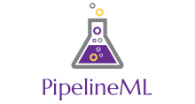

PipelineML is a C# project designed to help manage the machine learning process. Machine learning requires a lot of experimentation with altering input data, data pre-processing and 
cleaning, testing out various machine learning parameters, training, measuring, post-processing data steps, success, and analytics. It is often hard to keep track of all the experiments parameters and what made them different. 

This codebase aims to manage the auditing and processing of your ML experiments so that you can focus on the problem at hand.

Serializable template that can create a Pipeline Instance. Should contain all the types and configuration 
that define a pipeline, with an end step to simulate (this part currently is not generisized, but probably should be).

----------

 1. Dataset Generator
 2. Preprocess Data Transforms
 3. Machine Learning Algorithim collection (all can run in parallel on the preprocessed data)
 4. Postprocess Data Tranforms
 5. Evaluators - this will compare the effectiveness of the various machine learning algorithms relative to each other / or absolute.
 6. Trade Simulation - Step to specifically go run a simulation with the trained machine learning algorithm

(edited with https://stackedit.io/editor)

